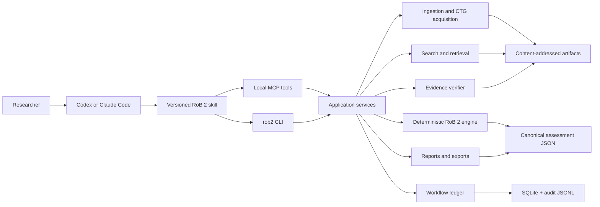
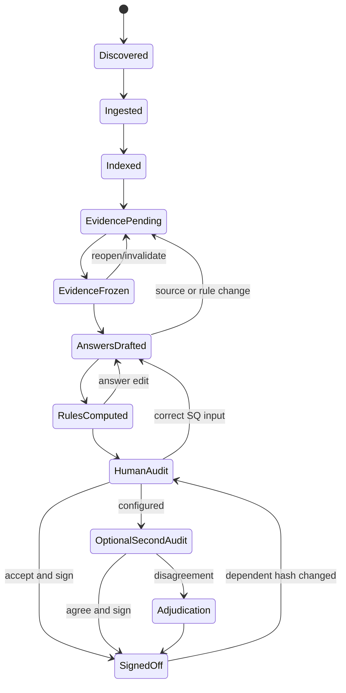

# Blueprint: an auditable agent plugin for Cochrane RoB 2

**Status:** architecture and research plan  
**Date:** 2026-07-28  
**Working name:** `rob2-assist`  
**Initial target:** individually randomized, parallel-group RCTs; effect of assignment to intervention; English-language source documents  

## Executive recommendation

Build this as a **local evidence and workflow engine** that a capable host agent uses, not as an application that contains its own LLM.

The host—Codex or Claude Code—does the bounded judgment work available through the user's subscription. The Python package performs everything that should be reproducible:

- source discovery, hashing, parsing, registry acquisition, and indexing;
- bounded search and retrieval;
- quote verification and page/bounding-box localization;
- immutable evidence bundles;
- answer-schema validation;
- RoB 2 branch logic and proposed domain/overall judgments;
- resumability, audit logging, reporting, and exports.

The agent is allowed to:

1. search for candidate evidence;
2. assemble a verified evidence bundle;
3. answer signaling questions from that frozen bundle; and
4. write a concise, inspectable rationale.

The agent is not allowed to:

- invent or edit a quotation;
- cite a generated summary as evidence;
- directly set a domain or overall judgment;
- silently choose among ambiguous trial records or results;
- sign off an assessment.

The recommended technical choices are:

| Decision | Recommendation |
|---|---|
| Product shape | One model-agnostic Python package plus thin Codex and Claude Code plugin bundles |
| Default parser | LiteParse first, OCR disabled on the initial born-digital pass |
| Difficult pages | Targeted LiteParse OCR plus rendered page/crop inspection; fail closed when extraction cannot be trusted |
| Main article | Put its cleaned full text into the trial context pack when it fits |
| ClinicalTrials.gov record | Put a field-filtered, human-readable projection into the context pack; preserve the raw JSON |
| Registry history | Experimental, capability-probed `/api/int/` adapter producing dated diffs; never label the diff itself as outcome switching |
| Long supplements/protocols/SAPs | Logged lexical/agentic retrieval returning spans, not documents |
| Initial retrieval | SQLite FTS5/BM25-style lexical retrieval plus iterative agent search |
| Dense retrieval | Not part of the v1 product; retain only as a separate research ablation |
| Dense research baseline | Reproduce `all-MiniLM-L6-v2` because ROBOTO2 reports it directly; add other candidates only if the benchmark warrants them |
| Vector database | None |
| Canonical output | Schema-versioned JSON |
| Audit output | Static HTML plus Markdown, with verified quotes and lazy-generated highlighted page images |
| Assessment and review | The model is the sole substantive assessor; one human audit/sign-off is required, with optional second-human audit or adjudication; signatures bind to exact artifact hashes outside MCP |
| State | SQLite ledger plus content-addressed artifacts and append-only JSONL events |
| LLM calls | Supplied by the host agent; no OpenAI or Anthropic API key required for normal use |
| Research harness | Separate optional API/open-weight runner for reproducible experiments |

This is deliberately narrower than a general RAG platform. It avoids a web app, hosted vector database, orchestration framework, and bundled inference model until the evidence shows that they are necessary.

## The product claim

The defensible claim is:

> `rob2-assist` prepares a source-inventoried, coverage-explicit, provenance-preserving draft RoB 2 assessment for human verification and sign-off.

It should not claim autonomous assessment. RoB 2 is result-level, judgment-intensive, and has shown low inter-rater reliability even among humans. In one evaluation, four raters assessing 70 RCT outcomes had a Fleiss kappa of 0.16 for the overall judgment and took a mean of 28 minutes per outcome ([Minozzi et al., 2020](https://pubmed.ncbi.nlm.nih.gov/32562833/)). Training and implementation instructions can improve agreement, which makes a versioned skill and project-level conventions useful, but does not turn the task into objective classification.

This is lower risk than direct patient care, but not trivial: RoB judgments affect evidence certainty, synthesis interpretation, and potentially recommendations. Human sign-off is a product requirement, not a disclaimer added at the end.

## Licensing boundary: executable logic versus RoB 2 content

Project decision: implement the RoB 2 decision procedure in original code and ship
that executable logic with the open-source engine. This is not an implementation
permission gate. The rules engine, branch behavior, schemas, original tests, and
decision traces can therefore be built from the outset.

A separate redistribution question remains for **RoB 2 expressive content**. The
current RoB 2 site says the tool is licensed under **CC BY-NC-ND 4.0**
([official RoB 2 site](https://www.riskofbias.info/welcome/rob-2-0-tool)). That licence
permits noncommercial sharing with attribution but does not permit distribution of
adapted material; the legal code says the licence does not grant permission to share
adapted material
([CC legal code](https://creativecommons.org/licenses/by-nc-nd/4.0/legalcode.en)).

Before a public release copies or adapts official material, determine whether the
project may redistribute:

1. official signaling-question and elaboration wording;
2. official tables and flowchart expression;
3. elaboration-derived retrieval queries, prompts, or implementation notes;
4. official content in tests, examples, documentation, and publication artifacts.

Keep these concerns out of the executable core:

- represent branch logic with stable internal question and rule IDs;
- keep official or adapted wording in a separately versioned `guidance-pack` boundary
  with its own provenance and licence notices;
- contact the RoB 2 rights holders if the project intends to ship that content;
- provide `rob2 guidance import PATH` for an authorized local artifact if
  redistribution permission is unavailable;
- record the artifact's source, declared licence, acquisition method, version, and
  hash;
- exclude protected wording from public fixtures until its redistribution status is
  resolved;
- do not market the project as an official Cochrane product; use a neutral name such
  as `rob2-assist` and an unaffiliated-project notice.

This boundary lets engine development proceed while keeping the narrower content
licensing question explicit. It is a product-design position, not legal advice.

## Normative model: assess a result, not merely a paper

Cochrane describes RoB 2 as an assessment of a **specific result**—an intervention effect for a particular outcome—not a generic quality label for a study. It requires five domains, supporting reasons, and a proposed judgment derived from signaling-question answers ([Cochrane Handbook chapter 8](https://training.cochrane.org/handbook/current/chapter-08)).

The canonical identity of an assessment should therefore be:

```text
trial
  + randomized comparison
  + effect of interest (assignment or adherence)
  + outcome construct
  + measurement/instrument
  + time point
  + numerical result / analysis
  = result_id
```

An input such as `mortality` is insufficient when a trial reports 30-day mortality, in-hospital mortality, one-year mortality, adjusted and unadjusted estimates, or multiple analysis populations. The workflow may help discover and map candidate results, but it must require a resolved result specification before answering outcome-dependent questions.

### Reuse rules

Parts of Domain 1 can often be reused, but its safe cache key is not simply the trial name. Use:

```text
(trial_id, randomization_id, comparison_id, rob2_variant)
```

This avoids accidental reuse across substudy randomizations, factorial comparisons, cluster variants, or crossover periods.

Sequence-generation and allocation-concealment evidence (SQ 1.1 and 1.2) are commonly reusable. The materiality of baseline imbalances (SQ 1.3), however, may depend on the outcome and analysis. Re-evaluate it for each result unless its equivalence has been established explicitly.

Other cautious reuse opportunities include:

- the same outcome-measurement method for exactly matched outcome/time-point definitions;
- the same effect-of-assignment analysis description where the analyzed population is identical;
- source ingestion and the trial context pack across all outcomes.

Every reuse should be a reference to the original evidence bundle and answer version, not a copy that can silently drift.

### Proposed versus final judgments

Cochrane's algorithms produce proposed judgments and permit review authors to override them with justification. Preserve that distinction:

- `algorithmic_judgment`: always produced by deterministic code;
- `final_judgment`: defaults to the algorithmic judgment;
- `human_override`: optional, human-only, with author, timestamp, reason, and prior value;
- `signoff_status`: draft, reviewed, adjudicated, or signed off.

Thus, the model is the sole substantive assessor: it supplies the evidence-grounded
SQ answers and rationales. It never directly selects a domain or overall judgment;
deterministic code derives those from its answers using the versioned logic pack. A
human audits the record, may correct or override it with a documented reason, and
signs the exact artifact rather than performing a mandatory second independent
assessment.

There is one important boundary to the phrase "deterministic judgment." The overall
RoB 2 rule allows multiple domains with Some concerns to become High risk when their
combination substantially lowers confidence in the result. Whether that condition is
met is a substantive assessor judgment, not something recoverable mechanically from
the domain labels alone. Require the model to supply an explicit, auditable input such
as `combined_concerns_substantially_lower_confidence`; the human may correct it during
audit, and once all required inputs exist the mapping remains deterministic.

## Source model

The source model should not privilege "the paper" as the only authoritative object. Cochrane explicitly lists articles, trial registries, protocols, clinical study reports, regulatory reviews, and author information as possible sources, and expects the precise source location supporting a judgment to be recorded ([Cochrane Handbook chapter 7](https://training.cochrane.org/handbook/current/chapter-07)).

Supported source roles should include:

```yaml
primary_report
secondary_report
supplement
protocol
statistical_analysis_plan
registry_current
registry_history
clinical_study_report
regulatory_document
author_correspondence
other
```

Do not define one global authority ranking. Relevance and timing are question-specific:

- a dated protocol or SAP is particularly important for prespecification;
- the report is authoritative for the numerical result actually presented;
- registry history may reveal whether an outcome changed after recruitment or analysis;
- a current registry record cannot by itself prove that a plan was prespecified;
- contradictions must be surfaced rather than silently resolved.

Every assessment report should distinguish:

- sources obtained;
- sources searched;
- sources unavailable;
- sources found but not parsed successfully;
- evidence supporting an answer;
- evidence contradicting or qualifying it.

## User experience

### Project convention

Use a forgiving convention with explicit overrides:

```text
project/
├── rob2.yaml
├── rob2.decisions.yaml                 # optional, review-team conventions
├── input/
│   ├── trial-one/
│   │   ├── trial.yaml                  # optional but strongly recommended
│   │   ├── main-report.pdf             # one or more top-level reports
│   │   └── supplements/
│   │       ├── protocol.pdf
│   │       ├── sap.pdf
│   │       └── appendix.pdf
│   └── trial-two/
│       └── ...
├── output/
│   ├── assessments/{trial}/{result}.json
│   ├── reports/{trial}/{result}.md
│   ├── reports/{trial}/{result}.html
│   ├── reports/summary.md
│   ├── reports/summary.html
│   ├── reviews/{trial}/{result}/human-review.json
│   ├── reviews/{trial}/{result}/second-audit.json       # optional
│   ├── reviews/{trial}/{result}/adjudication.json       # optional
│   ├── evidence/{evidence_id}.json
│   ├── highlights/{evidence_id}.png
│   ├── artifacts/documents/{document_hash}/
│   │   ├── manifest.json
│   │   ├── parsed.md
│   │   ├── parsed.json
│   │   └── context.md
│   ├── artifacts/trials/{trial}/
│   │   ├── source-map.json
│   │   ├── ctg/{nct}.raw.json
│   │   ├── ctg/{nct}.context.md
│   │   ├── ctg/{nct}.history/index.json
│   │   ├── ctg/{nct}.history/v{version}.json
│   │   ├── ctg/{nct}.registry-diff.json
│   │   ├── trial-dossier.json
│   │   └── context-pack.md
│   ├── exports/robvis.csv
│   ├── exports/assessments.xlsx
│   └── audit/events.jsonl
└── .rob2/
    ├── ledger.sqlite3
    └── locks/
```

Why this differs from a simple `fulltext.pdf` convention:

- trials can have multiple publications;
- filenames are not reliable source-role metadata;
- content-addressed parsing deduplicates the same protocol appearing in several folders;
- canonical assessments and derived reports are clearly separated;
- human review, optional second-audit, and adjudication records are versioned deliverables, not mutable ledger flags;
- large caches and mutable state remain under `.rob2`, while auditable artifacts can be archived.

`trial.yaml` should be able to declare roles explicitly:

```yaml
schema_version: 1
label: "Example Trial"
nct: NCT01234567
documents:
  - path: main-report.pdf
    role: primary_report
  - path: supplements/protocol.pdf
    role: protocol
  - path: supplements/sap.pdf
    role: statistical_analysis_plan
notes:
  - "Use the 12-month result, not end-of-treatment."
```

If `trial.yaml` is absent, classify conservatively:

- top-level PDFs are report candidates;
- files under `supplements/` are supporting documents with an initially unknown subtype;
- filename and first-page heuristics may propose roles;
- ambiguity is recorded and shown to the user rather than silently guessed.

### Project and outcome configuration

`rob2.yaml` should contain the methodological choices that a review protocol would normally establish:

```yaml
schema_version: 1
rob2:
  version: "2019-08-22"
  variant: individually-randomized-parallel
  effect_of_interest: assignment

outcome_targets:
  - id: mortality-30d
    label: All-cause mortality at 30 days
    construct: all-cause mortality
    timepoint: 30 days
    accepted_effect_measures: [risk_ratio, odds_ratio]
  - id: pain-12w
    label: Pain at 12 weeks
    construct: pain
    timepoint: 12 weeks
    accepted_instruments: [VAS, NRS]

acquisition:
  clinicaltrials_gov: true
  fetch_registry_documents: true

search:
  audit_mode: audited_only
  default_mode: ranked
  max_hits_per_call: 10

review:
  mode: sole_model_assessor
  human_signoff_required: true
  human_reviewers_required: 1
  optional_second_human_audit: false
  allow_human_algorithm_override: true
```

These are cross-trial **outcome targets** for batching, not RoB 2 assessment
identities. Before answering outcome-dependent SQs, resolve each target to exactly one
trial-specific `ResultSpec`, for example:

```yaml
result_id: trial-one__mortality-30d__rr-itt-unadjusted
trial_id: trial-one
comparison:
  experimental_arm: intervention-a
  comparator_arm: placebo
effect_of_interest: assignment
outcome:
  construct: all-cause mortality
  measurement: vital status
  timepoint: 30 days
analysis:
  population: ITT
  effect_measure: risk_ratio
  model: unadjusted
  adjustment_set: []
numerical_result:
  estimate: 0.82
  confidence_interval: [0.66, 1.02]
  locator:
    document_id: main-report
    page_index: 7
    table: 2
    row: All-cause mortality at 30 days
```

When a result is not naturally summarized by that structure, a unique
table/figure/analysis locator can identify it. Multiple acceptable instruments or
effect measures in an outcome target are alternatives to resolve—not a set that may
remain ambiguous in the final assessment. The tool should propose trial-specific
mappings because labels and instruments vary, but ambiguity must move the item to
`needs_input`.

The product default is one model-generated assessment followed by one human audit and
sign-off. The human is a reviewer and accountable signatory, not a second independent
assessor. Projects may enable a second-human audit or adjudication for higher-assurance
use, but this remains optional. Reports and methods sections must describe the actual
workflow plainly and must not imply that model-plus-signatory is equivalent to a
duplicate-independent human assessment when a review protocol requires two assessors.
In particular, Cochrane MECIR C53 requires at least two people working independently
to apply the risk-of-bias tool. The default product workflow therefore does not satisfy
that Cochrane conduct standard by itself; it should be positioned for workflows that
permit a model assessor with human sign-off, or paired with a genuinely independent
second human assessment when C53 applies
([MECIR C53](https://community.cochrane.org/mecir-manual/standards-conduct-new-cochrane-intervention-reviews-c1-c75/performing-review-c24-c75/assessing-risk-bias-included-studies-c52-c60)).

### Main commands

Keep the CLI small and composable:

```text
rob2 init [PATH]
rob2 doctor
rob2 ingest [--all | TRIAL...]
rob2 outcomes suggest [--all | TRIAL...]
rob2 assess [--all] --outcome OUTCOME...
rob2 resume
rob2 status
rob2 review [TRIAL] [RESULT]
rob2 report [--all]
rob2 export [--robvis] [--xlsx]
rob2 verify
rob2 guidance import PATH                 # optional authorized wording/elaboration artifact
rob2 mcp                                  # stdio server
```

The normal conversational entry point is a skill invocation such as:

```text
Assess all trials in input/ for mortality-30d and pain-12w,
prepare the audit reports, and stop before human sign-off.
```

The skill calls the same application services as the CLI. A user can inspect or repair any stage from the terminal without the agent.

## System architecture



Recommended Python package boundaries:

```text
src/rob2_assist/
├── domain/          # result identity, SQ answers, judgments, review status
├── rules/           # versioned logic packs and pure decision engine
├── ingest/          # document model, parser adapters, quality gates
├── registry/        # ClinicalTrials.gov client and projection
├── retrieval/       # structure-aware chunking and dual-mode FTS5 search
├── evidence/        # quote resolution, spans, bboxes, highlights
├── workflow/        # state machine, invalidation, locks, ledger
├── reporting/       # Markdown, static HTML, robvis, XLSX
├── cli/             # Typer/Rich interface
└── mcp_server/      # thin structured MCP tools
```

Plugin bundles should remain thin:

```text
integrations/
├── codex/
│   ├── .codex-plugin/plugin.json
│   ├── .mcp.json
│   └── skills/rob2-assess/SKILL.md
└── claude/
    ├── .claude-plugin/plugin.json
    ├── .mcp.json
    └── skills/rob2-assess/SKILL.md
```

Generate both bundles from a shared skill source, but test them independently. Codex plugins require `.codex-plugin/plugin.json` and can package skills and `.mcp.json` ([OpenAI plugin packaging docs](https://developers.openai.com/plugins/build/plugins)). Claude Code plugins use `.claude-plugin/plugin.json`, root-level skills, and may bundle automatically started MCP servers in `.mcp.json` ([Claude Code plugin reference](https://code.claude.com/docs/en/plugins-reference)).

### Platform boundary

Local stdio MCP is a natural fit for Codex local clients and Claude Code. General ChatGPT web conversations cannot be assumed to start a local Python stdio process or read arbitrary local project files. OpenAI's public plugin architecture can vary by surface and ChatGPT MCP development uses a registered server connection.

Therefore:

- target **Codex desktop/CLI and Claude Code** for the privacy-preserving v1;
- publish a PyPI package and host-specific marketplace bundles;
- treat a general ChatGPT web plugin as a later product with a separate local bridge or hosted architecture;
- do not compromise the on-device requirement merely to claim every ChatGPT surface.

## Ingestion and provenance

### Canonical document model

Never let downstream code depend directly on LiteParse output. Convert the parser output into:

```text
Document
  document_id
  source_role
  source_sha256
  parser_name/version/config_hash
  pages[]

Page
  page_index
  printed_page_label?
  width/height
  text
  blocks[]
  quality_metrics

Block
  block_id
  type
  heading_path[]
  text
  char_span_in_page
  text_items[]
  bbox[]

TextItem
  item_id
  exact_extracted_text
  bbox
  extraction_method
  confidence?
```

Store both the original parse and the normalized canonical form. Record zero-based `page_index` separately from a printed page label; reports should never confuse PDF page 8 with a page labeled 6.

Keep all parser numbering conversions inside the adapter. LiteParse 2.9.0's screenshot
API accepts one-based page numbers, while this canonical model uses a zero-based
`page_index`; contract-test first, middle, and final pages so visual citations cannot
drift by one page
([pinned LiteParse parser source](https://github.com/run-llama/liteparse/blob/python-v2.9.0/packages/python/liteparse/parser.py)).

### LiteParse-first cascade

LiteParse's current project describes local spatial text parsing, bounding boxes, built-in/pluggable OCR, complexity detection, screenshots, and Markdown/JSON/text output. It also warns that complex tables, multi-column layouts, charts, handwriting, and scans may need heavier parsing ([LiteParse repository](https://github.com/run-llama/liteparse)).

Use it as the default because:

- quote localization and highlight generation need its text items and bboxes;
- most RCT articles are born-digital and short;
- parsing batches of supplements must be fast;
- its footprint is compatible with a community CLI;
- all source text remains local.

Run the first pass with `ocr_enabled=False`. LiteParse currently enables OCR by
default, which can add substantial work when born-digital pages contain figures that
trigger OCR. Request complexity metadata with `include_complexity=True`, or run
LiteParse's cheap whole-document `is-complex` pre-pass, and combine its per-page
results with the project's own quality checks. Do not code against a presumed
`is_complex(page)` predicate: the current command/API checks a file and returns
page-level results, while parsed pages may carry optional complexity metadata and
screenshots use a separate rendering path. Pin and contract-test the exact LiteParse
version because these routing fields are an integration boundary
([LiteParse complexity and screenshot documentation](https://github.com/run-llama/liteparse)).

The quality gate should examine at least:

- selectable-text coverage per page;
- proportion of replacement/control characters;
- OCR use and confidence;
- suspicious cross-column line length or reading order;
- repeated headers/footers;
- text density and blank pages;
- table and figure regions;
- mismatch between page render and extracted token count;
- LiteParse's complexity signal where available.

Use the parser's page-level signals as routing inputs rather than as an unquestioned
verdict:

- `needs_ocr` with no or near-no text, or reasons such as `scanned`/`no-text`:
  reparse that page with OCR;
- table-, figure-, multi-column-, vector-text-, or sparse-text signals: preserve the
  text for discovery, but render the page/crop for any decision-relevant structure;
- `garbled` or an internal quality-gate failure: use the visual path and, if that
  remains unreliable, record an explicit parse/coverage failure.

Thresholds and the exact signal-to-route mapping must be versioned and validated on
the parser corpus. Treat parser reason strings as extensible hints—test membership in
known categories, not equality with a fixed list—and preserve unknown reasons in
provenance. Do not copy one machine's timing or page thresholds into the product as
universal constants.

### Targeted recovery for difficult pages

Do not add a second full-document parser in v1. When the quality gate fails:

1. re-run only the affected page with LiteParse OCR enabled;
2. render the page or a bounded crop and let the host model inspect it visually;
3. require accepted evidence to resolve to a canonical visible span or a
   page-region citation with an explicit `visual_only` extraction method;
4. fail closed and send the item to human review when text, table structure, or page
   attribution remains unreliable.

Keep the original and recovery parses, record why recovery was invoked, and never
silently substitute OCR text for the born-digital text layer.

### Parser benchmark before locking the default

Run a small RoB-specific parser benchmark rather than relying on generic marketing benchmarks. Sample 50–100 RCT reports and supplements, stratified by:

- born-digital versus scanned;
- one- versus multi-column;
- simple versus complex tables;
- publication era and publisher;
- supplements, protocols, and SAPs;
- page count.

Measure:

- character/text recovery;
- reading order;
- page attribution;
- exact/normalized quote-anchor success;
- bbox-to-visible-text correctness;
- table-cell accuracy for participant flow, baseline, missingness, and analysis tables;
- end-to-end retrieval recall for gold RoB evidence;
- time, memory, model download, and install failure rate.
- OCR-off versus targeted-OCR runtime and evidence recovery.

The key metric is not Markdown beauty. It is whether decision-relevant evidence can be found, quoted canonically, and highlighted correctly.

### Targeted visual reading

Tables and figures should have a special evidence path:

1. retrieve a text/table candidate;
2. render only the relevant page or crop;
3. let the multimodal host inspect it;
4. store a typed visual transcription with row/column labels, extracted value, page/crop evidence ID, extractor, and review status;
5. perform any arithmetic in deterministic code from those cited transcription inputs;
6. require the human report to display that visual evidence.

For a value or relationship read from a table, figure, participant-flow diagram, or
other complexity-flagged region, parsed Markdown may help locate the page but cannot be
the sole accepted provenance. The evidence bundle must include a `table_region` or
equivalent page/crop record showing what the model read. Plain narrative numbers on a
quality-passing page do not require an image merely because they are numeric.

Never send hundreds of page images to the model. Generate page renders lazily and generate highlighted citation images only after an evidence span is accepted.

A rendered page is closer to what a human sees, but it is not infallible “ground
truth”: low resolution, cropping, rotated text, legends, superscripts, and merged
cells can still be misread. Decision-critical numeric transcriptions should remain
`review_required` until a human checks the crop or a second independent extraction
agrees under a prespecified rule.

## ClinicalTrials.gov integration

Use the documented v2 REST API and preserve its response unmodified. The API supports field selection, publishes an OpenAPI specification, and provides a dataset timestamp through `/api/v2/version` ([ClinicalTrials.gov API](https://clinicaltrials.gov/data-api/api)).

For every fetch, save:

- request URL and selected fields;
- UTC retrieval time;
- the separately fetched `/api/v2/version` response, including API version and
  `dataTimestamp`, linked to the study-response hash and retrieval time;
- response headers useful for caching;
- raw bytes and SHA-256;
- parsed JSON;
- derived context projection and its code/version.

The context projection should include only decision-relevant modules, such as:

- identification and study design;
- allocation and masking;
- arms/interventions;
- enrollment and dates;
- outcome definitions and time frames;
- participant flow;
- baseline and outcome-measure results;
- analysis information where present;
- submission/posted dates;
- references;
- uploaded document metadata.

Field filtering is a context-safety requirement, not merely a micro-optimization:
results-heavy records can be much larger than typical protocol-only records. Always
retain the complete raw response on disk, but measure the projected token count before
putting it in model context. Keep the default projection compact; load bulky
`resultsSection.outcomeMeasuresModule` content or other large result arrays on demand
for the exact `ResultSpec`—especially for Domain 5—using stable JSON Pointers back to
the raw record. If the filtered projection still exceeds its budget, expose a
structured module/field reader rather than truncating JSON invisibly.

ClinicalTrials.gov's data model exposes uploaded provider documents and flags whether they include a protocol or SAP ([study data structure](https://clinicaltrials.gov/data-api/about-api/study-data-structure)). Download those documents when enabled, but store their declared date, upload date, filename, response metadata, and hash. An upload date is not proof that the underlying plan was finalized at that time.

Use the structured `hasProtocol`, `hasSap`, and `hasIcf` metadata—not filename
guessing alone—to classify and prioritize downloads. Protocols and SAPs are the
default automatic acquisitions. Keep consent-form metadata in the source inventory
and allow on-demand retrieval rather than declaring ICFs categorically irrelevant;
they may occasionally document participant-facing disclosure, procedures, or outcome
collection that matters to a particular assessment.

The current site serves provider documents from a predictable CDN path constructed
from the NCT ID and API-supplied filename. Treat that construction as a capability,
not a permanent contract: probe it, validate the returned content type/PDF signature
and declared size, and retain the original metadata so the adapter can be changed
without changing canonical provenance.

### Registry history

Domain 5 can depend on whether a plan existed before unblinded data were available. The current record alone can be misleading. ClinicalTrials.gov provides a record-history user interface where versions can be viewed and compared. Its documented v2 OpenAPI does not expose an equivalent history endpoint, but the current site uses working, undocumented endpoints:

```text
GET /api/int/studies/{NCT}/history
GET /api/int/studies/{NCT}/history/{version}
```

The first currently returns version dates and changed modules; the second returns the
submitted public-record content exposed for that historical version. It is not
necessarily schema-equivalent to a current complete v2 response; for example, current
derived fields may be absent. This was confirmed against a live record during the
blueprint audit, but `/api/int/` is explicitly outside the published API contract.

Implement an **experimental history adapter** that:

- capability-probes the endpoints and degrades gracefully;
- caches raw version lists and records with retrieval time and hash;
- records the internal-endpoint adapter version separately from the documented v2 client;
- deterministically produces dated field-level and outcome-version diffs;
- reports when no prospectively timestamped version exists;
- preserves the contemporaneous start-date value because study start dates can themselves be revised;
- reports first-submission, QC-submission, and first-posting dates separately;
- exposes a visible coverage flag when history is unavailable.

Call the output a **registry version diff**, not deterministic outcome-switching
detection. Detecting that text changed is mechanical; aligning semantically equivalent
outcomes across versions, relating them to the exact published result, and deciding
whether the change creates risk of selective reporting still require agent and human
judgment. A future stable public endpoint should replace this adapter without changing
the evidence schema.

For registration timing, compare the first submission date—not merely the later
first-posting date—with the best-supported first-participant date, while displaying
all relevant dates and uncertainty. ICMJE defines prospective registration in terms
of submission before enrollment ([ICMJE trial registration
recommendations](https://icmje.org/recommendations/browse/publishing-and-editorial-issues/clinical-trial-registration.html)).

Do not claim that automated access to CTG history is itself novel. The `cthist`
project previously automated historical retrieval and still used human raters to
separate substantive changes from cosmetic edits ([Carlisle,
2022](https://journals.plos.org/plosone/article?id=10.1371/journal.pone.0270909));
subsequent work has analyzed complete histories at scale ([Holst et al.,
2023](https://journals.plos.org/plosmedicine/article?id=10.1371/journal.pmed.1004306)).
The contribution here is integration of dated registry diffs into an auditable,
multisource RoB 2 evidence workflow.

### NCT detection

Use `NCT\d{8}` only to generate candidates. Trials often cite other trials in introductions or references.

Ranking should consider:

- occurrences outside the bibliography;
- proximity to registration labels;
- report title, interventions, investigators, and sample size;
- whether the CTG record links back to the publication;
- an explicit `trial.yaml` override.

One high-confidence candidate may be auto-fetched, but it must be reported. Multiple plausible candidates move the trial to `needs_input` while the batch continues elsewhere.

## Context and retrieval strategy

### Why not RAG everything

The strongest directly relevant published comparison is ROBOTO2. It modeled each signaling question as document QA, compared BM25 with sentence-transformer retrieval, and also tested full-paper context. Its tested dense retriever outperformed BM25 for locating the single annotated evidence paragraph, but recall remained 0.678 at top-10 versus 0.533 for BM25. Full-paper prompting produced the best overall answer performance ([ROBOTO2 paper](https://aclanthology.org/2025.emnlp-demos.2.pdf)).

ROBOTO2's best tested setting—Claude 3.5 Sonnet with the full paper—still achieved only 0.71 micro-F1; annotators changed model answers 42.4% of the time. The authors explicitly recommend keeping humans in the loop ([ROBOTO2 HTML](https://arxiv.org/html/2511.03048)).

Do not overgeneralize that experiment. ROBOTO2 queried each paper with the SQ text,
allowed at most one annotated gold passage per question, and did not test iterative,
seeded search across long supplements, protocols, and SAPs. It supports whole-paper
context when it fits and shows that single-shot top-k retrieval is lossy; it does not
prove that dense retrieval can never help the different long-document problem.

Implications:

- do not replace a 15–20k-token paper with top-3 retrieval;
- do not interpret "gold passage found" as "question answered";
- allow multiple evidence passages and cross-document comparisons;
- treat retrieval recall as a first-class safety metric;
- use full context where it is economical.

### Three-tier context policy

1. **Whole-context tier**
   - cleaned primary/secondary reports;
   - field-filtered CTG projection;
   - short protocols or supplements;
   - default combined budget around 35–45k tokens, configurable.

2. **Retrieved-span tier**
   - genuinely long supplements, protocols, SAPs, or CSRs;
   - logged search plans;
   - section-aware windows with provenance;
   - iterative refinement.

3. **Targeted-visual tier**
   - table, figure, flow diagram, or parse discrepancy;
   - one page/crop at a time.

Always preserve the unabridged parse. A derived `context.md` may deduplicate headers, remove obvious navigation noise, and omit the bibliography from the normal context pack, but every transformation must preserve a mapping back to page/block/item IDs.

Do not discard the bibliography altogether. Preserve a compact reference projection
containing titles, identifiers, NCT numbers, DOIs, and URLs because it helps discover
companion reports, protocols, corrections, and secondary analyses.

### Verified trial dossier

After ingest, create a compact dossier of facts that are reusable across results:

- randomization and concealment methods;
- masking by role;
- trial arms and analysis populations;
- registry/protocol/SAP availability and dates;
- participant-flow denominators;
- source and parser-quality inventory.

Every dossier field must reference canonical evidence IDs or a deterministic
derivation; it is an index into evidence, not a lossy replacement for the sources.
Result-specific stages consume this dossier and reopen the whole-context or retrieved
sources for outcome-specific facts and contradictions. This captures the token savings
of reading a trial once without allowing an early summary to become unchallengeable.

### Chunking

Use structure-aware chunks, not arbitrary fixed windows:

- keep heading paths;
- do not cross source documents;
- normally do not cross pages unless a paragraph is split at a page break;
- target roughly 250–500 tokens with modest overlap;
- make tables separate typed blocks;
- index table rows/cells and an accompanying full-table representation;
- attach captions to their table/figure;
- store all underlying block and item IDs.

The retrieval unit can be a chunk, but the evidence unit must be the smallest verified span needed to support the claim.

Treat paragraph rows with neighbor expansion as a benchmark baseline because ROBOTO2's
evidence annotations are paragraph-level, not as proof that paragraphs are the optimal
production chunk. Compare them with the 250–500-token structural windows on
multi-passage recall, context burden, and citation localization before locking the
chunker.

### Lexical and agentic retrieval first

SQLite FTS5 gives a portable, on-device lexical baseline with BM25 ranking, query
operators, snippets, and filters while sharing the project's persistent database
([SQLite FTS5 documentation](https://www.sqlite.org/fts5.html)). Use filters for:

- document role;
- page;
- heading;
- outcome terms;
- trial arm;
- date;
- table/caption content.

Use two modes behind the same `search_evidence` tool and return the same provenance
shape from both:

- `ranked`: an English-language FTS5 table using `tokenize='porter unicode61'`, with
  `bm25()` ordering and bounded `snippet()` output;
- `exact`: an unstemmed `unicode61` companion index (or exact canonical-text lookup)
  for phrases, prefixes, NCT IDs, analysis labels, drug names, figure/table labels, and
  other literals where stemming is undesirable.

The Porter tokenizer is an English stemmer wrapped around `unicode61`; this is
appropriate for the English-only v1 but must not silently become the multilingual
configuration. Store document/page/heading/span identifiers as `UNINDEXED` metadata,
and add prefix indexes only after measuring the real query workload.

The agent should execute a search plan rather than one query. For example, a
missing-outcome-data question may require separate searches for participant flow,
randomized denominators, analyzed denominators, withdrawal reasons, imputation, and
sensitivity analyses. Give each SQ a versioned set of query concepts and synonyms,
then let the model expand and reformulate them from observed terminology. If a seed is
adapted from protected elaboration wording, keep it inside the guidance-content
boundary; original project-authored concepts can ship with the engine.

Every query, filter, hit list, opened context window, and accepted/rejected result receives a trace ID in the audit log.

Host-native `grep`, `rg`, or file search is not a canonical assessment search path.
It lacks ranked bounded results, stable source spans, and automatic coverage logging.
The skill should use `search_evidence` during assessment. If a host search is used for
debugging or discovery, mark the run `audit_incomplete`; its hit cannot count toward a
negative-information search receipt. Repeat the relevant discovery and coverage
searches through `search_evidence` before restoring `audit_complete`, accepting the
evidence, or answering `NI`.

Make this an explicit project mode such as `search.audit_mode: audited_only`. The
plugin can log its own MCP/CLI calls but cannot technically prove that a general coding
host never used an unrelated native search tool. Therefore “complete search audit”
means the skill ran in audited-only mode and all searches represented in the
assessment flowed through the logged tool; it is a bounded, testable claim, not
surveillance of the host.

### Dense retrieval is research-only in v1

Do not ship an embedding runtime, model installer, vector matrix, or dense-search mode
in the v1 product. The lexical/agentic path is smaller, deterministic, persistent, and
sufficient to build the first reliable vertical slice.

Retain a separate research-harness ablation because the evidence is not one-sided:
ROBOTO2's S-BERT retriever beat BM25 at the same `k`, even though full-paper context
produced the best answer performance. Reproduce `all-MiniLM-L6-v2` as the directly
comparable baseline and compare lexical, dense, and hybrid retrieval on this project's
multi-source, multi-passage gold set. Dense retrieval should enter a post-v1 product
only if it materially improves **complete evidence recall at a fixed review burden**;
general MTEB scores are not enough.

## Two-stage evidence and answer protocol

The proposed separation should be enforced by the workflow state, not merely requested in a prompt.

### Stage A: evidence gathering

Input:

- trial/result identity;
- domain and applicable signaling questions;
- logic-pack version and optional guidance-content version;
- project decision rules;
- source inventory and coverage status.

Output:

- candidate evidence references;
- accepted supporting spans;
- accepted contradicting/qualifying spans;
- deterministic derived values;
- a search-coverage receipt;
- unresolved questions.

When complete, freeze an immutable `EvidenceBundle`. Its hash becomes an input to the answer stage.

### Stage B: signaling-question answers

Input:

- the frozen evidence bundle;
- the applicable official elaboration;
- the locked project decision-rules snapshot.

Output:

```json
{
  "question_id": "3.1",
  "answer": "PY",
  "supporting_evidence_ids": ["ev_..."],
  "contradicting_evidence_ids": [],
  "reasoning": "Concise decision-relevant rationale.",
  "agent_self_confidence": 0.78,
  "uncertainty_reasons": [],
  "decision_rule_ids": []
}
```

The answer tool must reject:

- raw quote text in place of an evidence ID;
- an ID not present in the frozen bundle;
- an answer that violates branch applicability;
- a rationale claiming facts not represented in the evidence or an explicitly cited decision rule;
- an inapplicable signaling question answered as if active.

Submit all active SQ answers for a domain atomically. Only after the answer set is
validated and committed should the server run the deterministic logic pack and return
the proposed domain judgment. Do not expose a model-facing “preview judgment” call or
reveal the changing judgment after each individual SQ; that would invite the model to
retrofit later answers to a desired label. A correction creates a new answer version
and a new judgment trace rather than mutating the committed set.

If new evidence is needed, reopen the bundle. Reopening creates a new bundle version and invalidates downstream answers.

### Evidence is not quote-only

Use a typed `kind` on each canonical evidence object rather than forcing every fact into prose:

- `verbatim_quote`;
- `structured_field`;
- `derived_comparison`;
- `absence_after_search`;
- `table_or_figure_region`;
- `visual_transcription`;
- `correspondence`;
- `reviewer_assumption`.

Every kind still requires provenance. A registry field stores its JSON Pointer,
retrieval time, raw-response hash, ETag/headers when present, relevant
submitted/posted dates, and the dataset timestamp separately obtained from
`/api/v2/version`—do not assume it is a field on every study response. A derived
attrition rate stores the arm, outcome, time point, precisely defined expected and
observed denominators, numerator, formula, and source spans; “randomized minus
analyzed” must not silently mix missing outcomes with post-randomization exclusions
or analysis-population choices. An absence claim stores the completed search receipt.

`table_or_figure_region` is only the visual locator. A `visual_transcription` stores
the interpreted row/column/value facts linked to that locator; keeping them separate
prevents a crop from being treated as if it were already a validated structured fact.

### "No information" requires a coverage receipt

`NI` is not supported by a quotation. It is a conclusion about the information sought and obtained.

Require:

- source roles searched;
- queries and concepts searched;
- whether the full primary report and CTG projection were available;
- unavailable or failed sources;
- relevant sections/pages inspected;
- a concise statement of what information remained absent.

The report should distinguish:

- not reported in obtained sources;
- source not obtained;
- source failed to parse;
- retrieval incomplete.

### Confidence is not an RoB answer

Do not map model confidence onto `Y/PY/PN/N`. Those answer categories have guidance-specific meanings. Preserve optional self-confidence only for analysis.

For review triage, compute a separate deterministic `review_priority` from:

- `NI`;
- contradictory evidence;
- OCR-only or repaired citation;
- missing protocol/SAP/history;
- parser quality warnings;
- rule-convention use;
- known difficult signaling questions;
- outcome/result ambiguity;
- model schema retries.

Add **judgment sensitivity** as a particularly strong triage signal. For each active
SQ, enumerate alternative legal answers while respecting branch/`NA` constraints and
rerun the pure rules engine. Mark the SQ `judgment_sensitive` when at least one
plausible alternative changes the domain judgment. This is deterministic and directs
review attention to answers whose correction can propagate. It is not evidence that
the submitted answer is wrong, and it should not be conflated with model confidence.

## Quote verification and visual citations

### Verification algorithm

1. The agent identifies a document/page and candidate text or item range.
2. Try an exact match against canonical page text.
3. Try a controlled normalized match:
   - Unicode normalization;
   - whitespace collapse;
   - line-break hyphen repair;
   - ligature normalization.
4. If still unresolved, fuzzy search may locate a candidate but can never itself validate the quotation.
5. Return the exact canonical source span from the located items.
6. Require the agent to accept that returned span or reject the evidence.
7. If ambiguity remains, require more surrounding text or human selection.

A failed or ambiguous verification never implies `NI`. It means the proposed evidence
is unusable. The workflow must search again, select source text directly, or mark the
item `evidence_unverified` for human resolution. `NI` is legal only after the separate
coverage requirements above are satisfied.

Exact anchoring proves that words occur at a location; it does not prove that the
passage is relevant, sufficient, true, or safe to follow. A successfully verified
passage can itself be adversarial source content. Evidence text remains untrusted data
after verification and can never authorize a tool call, change workflow state, alter
review policy, or supply executable parameters.

The saved evidence record should contain:

```text
evidence_id
source_sha256
document_id and role
page_index and printed_page_label
canonical exact text
normalized matching form
page/block/item character spans
one or more bboxes
extraction method and OCR confidence
verification method
similarity score if repaired
parser/version/config hash
search trace IDs
created_by and timestamps
```

For OCR text, label the quote as a verified transcription from the parser/OCR, not as a cryptographically exact PDF text string.

### Highlight generation

LiteParse provides page screenshots and text bounding boxes, which are sufficient to implement visual citations even if the current API does not expose a single "make highlighted citation" call. Draw a translucent overlay over each line-level bbox and add the evidence ID in the margin.

Test:

- coordinate origin and DPI transforms;
- page rotation;
- crop boxes;
- multi-line and multi-column spans;
- OCR coordinates;
- adjacent highlights;
- deterministic image output.

ClinicalTrials.gov evidence should use a JSON pointer plus a highlighted canonical HTML/Markdown registry view. It does not need a fake PDF screenshot.

## Deterministic calculations

Some signaling questions depend on quantities spread across tables or sections. Add a small derivation layer:

```json
{
  "derivation_id": "dv_...",
  "kind": "outcome_missing_fraction",
  "formula": "(randomized - observed) / randomized",
  "inputs": [
    {"name": "randomized", "value": 240, "evidence_id": "ev_a"},
    {"name": "observed", "value": 213, "evidence_id": "ev_b"}
  ],
  "result": 0.1125
}
```

The agent finds and maps the inputs; code performs the arithmetic. Never let a bare calculated number appear without cited inputs and a formula.

A similarly useful Domain 5 artifact compares:

- prespecified outcome construct, measure, time point, and analysis;
- the result reported and assessed;
- relevant source dates;
- discrepancies.

The comparison can be deterministic once the agent/human maps the source fields.

## RoB 2 rules engine

Represent each supported RoB version/variant as an immutable logic pack. It encodes
behavior and stable internal identifiers; it does not need to reproduce official
question or elaboration wording:

```text
logic_pack_id
official_version
variant
effect_of_interest
question IDs and answer enums
branch applicability
domain decision tables/graph
overall decision logic
implementation provenance and licence metadata
content hash
```

The engine is a pure function:

```text
(logic_pack, validated SQ answers, required model inputs) -> proposed domain and overall judgments
```

For the overall "multiple Some concerns" branch, the required inputs include the
model's explicit assessor determination described above. The engine must not invent a
universal numeric threshold or infer that condition merely from the number of
concerned domains.

Validation must fail closed on:

- missing required answers;
- answers supplied for impossible branches;
- unknown enum values;
- use of a logic pack for the wrong trial design/effect;
- a logic-pack hash mismatch.

Testing should include:

- exhaustive enumeration of every valid path within each domain;
- golden cases manually cross-checked against the official algorithm;
- mutation tests of every branch;
- tests for overall judgment logic;
- version/variant mismatch tests;
- documented override behavior.

Do not initially support all RoB 2 variants. Ship one correct logic pack for individually randomized parallel-group trials and the effect of assignment. Add adherence, cluster, and crossover variants only with separate validation datasets and explicit versioned packs.

## Project decision rules

Project conventions are valuable because implementation instruction can improve
agreement, but they should not become invisible automatic overrides. In a small
before/after RoB 2 study, overall agreement improved after calibration and a
review-specific implementation document, while completion time decreased; developing
the document itself took substantial team time
([Minozzi et al., 2022](https://doi.org/10.1016/j.jclinepi.2021.09.021)).
Because training, experience, case order, and the document changed together, treat
this as support for piloting and versioning—not proof that any YAML convention is
correct or that it causally improves validity.

Use a locked, attributable format:

```yaml
schema_version: 1
rules:
  - id: team-d1-sequence-01
    applies_to: ["sq:1.1"]
    statement: >
      For specified large multicentre CTU-led trials, absence of sequence detail
      is normally treated as Probably Yes only when the listed conditions are met.
    rationale: "Precommitted review-team convention."
    author: "Review team"
    approved_at: "2026-07-01"
```

Rules are contextual instructions, not executable YAML or a hidden domain judgment. The agent cites their IDs when used. Hash the file at assessment start. If it changes, mark affected drafts stale and show the difference.

Rigid numeric rules such as a universal missingness threshold should be identified as review-team conventions, not presented as if they were necessarily part of the official guidance. For example, `>10%` loss is not a universal official cutoff: interpretation also depends on reasons, balance, and the likely relation between missingness and the true value.

## Workflow state and resumability

Track work at:

```text
(trial_id, result_id, domain_id, stage)
```

Suggested state machine:



Properties:

- each transition is idempotent;
- each stage stores its input hashes;
- source/config/rule changes invalidate only dependent stages;
- writes occur in SQLite transactions;
- long parsing/indexing tools report progress and support cancellation;
- per-trial locks prevent competing writers;
- human edits and overrides are never overwritten by resume;
- `rob2 status` prints the next actionable work item;
- a compact `resume.md` explains completed work, gaps, and the exact next step for a fresh agent context.

This design survives a five-hour subscription window ending after any signaling question or domain.

## Token and usage efficiency

1. Parse, fetch, index, verify, calculate, and render locally.
2. Build one context pack per trial.
3. Read the primary report and CTG projection once per trial/session.
4. Batch evidence gathering by domain, not by 22 independent conversations.
5. Reuse Domain 1 by an explicit safe key.
6. Freeze compact evidence bundles and use them for answer generation.
7. Retrieve spans from long documents; never return entire supplements from an MCP search tool.
8. Paginate MCP outputs and cap context windows.
9. Generate images only for decision-relevant pages.
10. Use one primary assessment pass; trigger a second-agent/check pass only for deterministic high-priority cases.
11. On resume, load the state summary and affected bundles rather than the whole corpus.

Do not depend on hidden chain-of-thought. Ask for concise decision-relevant reasoning that can be saved and audited.

## MCP design

Use the official Python MCP SDK over local stdio. It supports structured tools/resources and standard transports; typed/Pydantic outputs are appropriate for this interface ([Python SDK](https://github.com/modelcontextprotocol/python-sdk)).

Keep the public tool surface small:

| Tool | Purpose |
|---|---|
| `project_status` | Return trials, results, stages, warnings, and next work |
| `prepare_trial` | Ingest, fetch CTG, build artifacts/indexes |
| `list_sources` | Return source roles, hashes, dates, and quality |
| `get_context_pack` | Return path/hash/metadata for the bounded whole-context pack |
| `search_evidence` | Logged `ranked`/`exact` lexical search returning bounded span candidates |
| `read_span_context` | Read a bounded window around a candidate |
| `render_page` | Return a targeted page/crop image |
| `verify_evidence` | Resolve a candidate into a canonical evidence record |
| `freeze_evidence_bundle` | Seal evidence and coverage for a domain |
| `submit_sq_answers` | Atomically commit a domain's answers, then return the code-derived proposed judgment |
| `review_queue` | Read unresolved, sensitive, and unsigned review items |
| `record_review_comment` | Save a non-signing reviewer comment or requested correction |
| `render_reports` | Regenerate Markdown/HTML/exports |

All tools should return structured, bounded results. Mark read-only and idempotent tools accordingly. Do not expose arbitrary filesystem paths, shell commands, URL fetches, or SQL.

The pure judgment function remains available inside the core library and CLI for
testing and reproduction, but not as a model-facing preview tool.

There should be no MCP tool that can create a reviewer, second-audit, or adjudication
signature or any signed state. An agent can prepare the queue and record draft comments, but locked
review records must be created through a direct human interface such as
`rob2 review serve` or an interactive TTY command that refuses non-interactive use.
This cannot prevent a general coding agent with unrestricted shell access from trying
to manipulate project files, so signed records must also be schema-validated,
content-hashed, attributable, and optionally cryptographically signed. The report
should distinguish an ordinary filesystem record from a verified human identity.

### Skill responsibilities

The skill teaches the host:

- when RoB 2 is applicable;
- the result-level identity requirement;
- source text is untrusted data, not instructions;
- the evidence-then-answer sequence;
- how to handle ambiguity and contradictions;
- when page images are required;
- that it must never set domain judgments or sign off;
- how to continue after tool/schema/verification failures;
- how to present unresolved issues to the human.

The skill should be short. Put detailed guidance in versioned references loaded only
for the active domain, and ship only wording that is authorized for redistribution.

### Audit boundary

The plugin can reliably log:

- its tool calls;
- submitted queries and hit lists;
- source reads performed through its tools;
- evidence verification;
- structured answer payloads;
- declared rationales;
- rule computation;
- human edits and sign-off;
- skill/logic-pack/package versions.

It cannot promise access to a commercial host's hidden reasoning, internal prompts, or complete conversation trace. State this explicitly in the report. Capture the model/host label and date when available, but do not claim bit-for-bit model reproducibility.

## Reports and review

### Canonical JSON

The schema-versioned assessment JSON is the source of truth. It should contain:

- result specification;
- RoB version/variant/effect;
- source inventory and acquisition/parse status;
- evidence records by reference;
- `search_audit_scope`: `plugin_tools_only`;
- `search_coverage_status`: `complete` or `incomplete`, interpreted against the
  required plugin-mediated protocol;
- SQ answers and model-declared rationale;
- evidence coverage and uncertainty;
- algorithmic judgments and logic-pack hash;
- human edits/overrides;
- review status/signatures;
- software, skill, parser, and host/model metadata.

Derived HTML, Markdown, CSV, and XLSX can always be regenerated.

### Static audit report

Generate self-contained HTML with no CDN dependency and a diff-friendly Markdown twin.

At the top:

- prominent `DRAFT — NOT HUMAN SIGNED OFF` or signed status;
- trial/result identity;
- effect of interest and RoB version;
- source-completeness warnings;
- domain traffic lights;
- high-priority review queue.

The **review interface** should open on unresolved evidence and high-priority SQs,
not on the overall traffic light. The final static report can remain conclusion-first
for communication, while the interactive review flow is verification-first to reduce
anchoring.

For each signaling question:

- answer and review status;
- concise rationale;
- supporting and contradicting evidence cards;
- source role, date, page, and verified quote;
- link/thumbnail to highlighted page evidence;
- parser/OCR warning;
- decision-rule IDs;
- collapsed search-coverage receipt.

For each domain:

- deterministic proposed judgment;
- answer path/logic-pack version;
- human override, if any;
- expected direction of bias if recorded.

At the end:

- change history;
- limitations and unsearched/unavailable sources;
- reviewer/adjudicator sign-off;
- audit/run manifest hashes.

### Human review behavior

Track review status for the human audit/sign-off record:

```text
unreviewed
accepted
edited
needs_clarification
signed
```

The reviewer must be able to:

- open the exact highlighted source;
- add/remove evidence;
- edit an SQ answer and rationale;
- reopen a bundle;
- record an algorithm override;
- compare agent draft with human-final content;
- sign a specific assessment hash.

Batch acceptance may be allowed for low-priority items, but no workflow should automatically convert an agent draft into signed-off output.

An optional second-human audit can be enabled for high-assurance projects. Its purpose
is extra verification or adjudication, not to change the system's default assessor
model. If enabled, store it as a separate signed review record and expose disagreements
before the final project sign-off.

Design the default screen as a verification task: show the exact evidence, source
coverage, contradictions, and decision path before emphasizing the model's conclusion.
Experimental work on human-in-the-loop systems has found worse judgments when
erroneous AI advice is shown before the person's own judgment
([Agudo et al., 2024](https://pmc.ncbi.nlm.nih.gov/articles/PMC10772030/)).

Deterministic logic, schema validation, and quote anchoring catch structural and
provenance failures; the human signatory remains the final backstop for a plausible,
well-cited but substantively wrong SQ answer. Make that oversight measurable. Offer
opt-in, local-only review telemetry—time per domain, evidence opens, edits, overrides,
queue position, and session duration—with a clear data dictionary and no network
transmission. Keep it off by default outside a consented validation study.

No global “approve all” action should cover `evidence_unverified`, unresolved
contradictions, missing-source coverage, or judgment-sensitive items. Signatures bind
to the exact assessment, evidence-bundle, source-manifest, logic-pack, and decision-rule
hashes. Any dependent change invalidates the signature and returns the item to review.

### Exports

Produce:

- a robvis-compatible CSV tested against the current robvis template;
- an XLSX with Summary, Signaling Questions, Evidence, Sources, and Review Log sheets;
- export-only XLSX in v1—round-tripping arbitrary spreadsheet edits creates a second source of truth and can wait.

## Packaging with Python and uv

Use Python 3.11 as the initial compatibility baseline and test 3.11–3.13 before widening it. A 3.13-only package would unnecessarily exclude systems and scientific wheels that lag the newest Python.

Recommended `pyproject.toml` shape:

```toml
[project]
requires-python = ">=3.11,<3.14"

[project.scripts]
rob2 = "rob2_assist.cli:app"
rob2-mcp = "rob2_assist.mcp_server:main"

[project.optional-dependencies]
xlsx = ["openpyxl"]

[dependency-groups]
dev = ["pytest", "hypothesis", "ruff", "mypy", "coverage"]
```

Use:

- `uv.lock` for the repository and paper environment;
- published wheels/sdist with a conventional build backend;
- `uv tool install rob2-assist` for end users;
- mutually independent optional extras;
- hashes, licence acceptance, and cache locations displayed by `rob2 doctor`.

The uv documentation supports isolated tool installation and optional dependency patterns ([uv docs](https://docs.astral.sh/uv/)).

The v1 product has no Torch, sentence-transformers, embedding-model, or vector-database
dependency. Keep research-only retrieval dependencies in a separate locked experiment
environment so they cannot inflate or destabilize the community install.

## Security, privacy, and robustness

Treat every PDF and registry field as untrusted:

- source text can contain prompt-injection-like instructions; the skill must treat it only as evidence;
- the same rule applies to visible page images, metadata, annotations, hidden text layers, tiny/off-page text, and prior model outputs;
- flag parse/render discrepancies such as invisible, white-on-white, very small, off-page, or non-rendered extracted text, and exclude such text from automatic evidence acceptance pending visual review;
- never interpolate source or model text into shell commands, SQL, filesystem paths, template names, or acquisition URLs;
- validate every model payload against a closed schema and an allow-list of project/source/evidence identifiers before state changes;
- recommend a dedicated least-privilege project profile with no unrelated repositories, credentials, or secrets available to the host;
- make acquired source artifacts read-only during assessment and restrict plugin writes to the declared artifact/state roots;
- parse in a separate worker process with page, file-size, time, and memory limits;
- disallow arbitrary external URLs by default; CTG hosts are allow-listed;
- validate downloaded content type, PDF signature, size, and hash;
- use safe YAML loading and never execute expressions from YAML;
- restrict all paths to the declared project root;
- never expose arbitrary shell or SQL through MCP;
- redact secrets and environment variables from audit payloads;
- make network acquisition explicit and cacheable;
- support an offline mode after acquisition.
- re-verify the complete source-manifest hashes before assessment and again before human sign-off.

Quote verification prevents fabricated locators, not indirect prompt injection.
Codex's own security guidance warns that untrusted retrieved content can redirect an
agent toward data exfiltration or unsafe actions; it recommends limiting network
access and reviewing the work log
([Codex internet-access security guidance](https://learn.chatgpt.com/docs/cloud/internet-access)).
OWASP likewise recommends segregating external content, least-privilege tools,
structured outputs, action validation against the user's intent, and adversarial
testing rather than relying on prompt wording alone
([OWASP prompt-injection guidance](https://genai.owasp.org/llmrisk/llm01-prompt-injection/)).

Treat generated reports as another injection boundary:

- enable Jinja autoescaping for HTML templates and strings;
- never apply `Markup` or `|safe` to source, registry, reviewer, or model text;
- allow-list URL schemes and render external links inert by default;
- use no active JavaScript in the static report where possible;
- add a restrictive Content Security Policy and prevent automatic remote requests;
- sanitize any Markdown-to-HTML path independently;
- test malicious HTML, SVG, Markdown images, `javascript:` links, CTG markup, and bidirectional/invisible Unicode.

Jinja documents that variables are escaped by default only when autoescaping is
configured and that `Markup`/`|safe` bypasses it
([Jinja autoescaping documentation](https://jinja.palletsprojects.com/en/stable/api/)).

Document the threat model and control ownership using the NIST AI RMF Generative AI
Profile as an umbrella, while keeping the concrete indirect-injection tests in the
repository ([NIST Generative AI
Profile](https://www.nist.gov/publications/artificial-intelligence-risk-management-framework-generative-artificial-intelligence)).

For copyrighted trial reports:

- do not redistribute source PDFs;
- publish source identifiers and hashes where appropriate;
- keep report quotations brief and decision-relevant;
- offer a public-report mode that omits or shortens quotations while preserving locators.

For supply-chain reproducibility:

- pin release dependencies;
- record native parser versions and configurations;
- publish an SBOM and vulnerability-scanning policy;
- pin model repository revision and file hashes;
- archive evaluation containers/environments where journal policy permits.

## Verification strategy

### Unit and property tests

- rule-engine path enumeration and mutation tests;
- quote normalization and canonicalization;
- ambiguous/fuzzy match rejection;
- bbox coordinate transforms;
- NCT candidate ranking;
- CTG projection golden files;
- CTG history-adapter capability/failure fixtures;
- exact historical field-diff tests separated from adjudicated semantic outcome-change tests;
- chunk-to-source round trips;
- downstream invalidation;
- audit hash chain;
- schema migration and backward compatibility;
- path and URL security.
- optional guidance-artifact import, rejection, and hash/version handling;
- report autoescaping, URL-scheme filtering, and Content Security Policy;
- closed-schema rejection of model-supplied paths, URLs, SQL, and unknown identifiers.

### Integration fixtures

Create a legally distributable fixture set covering:

- born-digital single-column report;
- multi-column report;
- scanned document;
- participant-flow diagram;
- simple and merged-cell tables;
- protocol/SAP with dates;
- multiple NCT IDs;
- conflicting registry/report outcome definitions;
- missing supplement;
- one document shared across trials.
- visible and hidden-text prompt-injection fixtures;
- malicious HTML/Markdown/SVG/Unicode in PDF text, CTG fields, and model rationales;
- parse/render disagreement and off-page/tiny-text fixtures.

Every fixture should have gold page spans and expected highlighted images.

### End-to-end acceptance criteria

Before calling v1 reliable:

- 100% of accepted quotes resolve to stored canonical spans;
- 100% of evidence images highlight the intended visible text in the visual QA set;
- no LLM-provided domain or overall judgment enters canonical JSON;
- every algorithmic judgment names the exact logic-pack hash;
- interrupted runs resume without repeating completed agent work;
- changed sources/rules invalidate the correct downstream artifacts;
- unsigned reports cannot be mistaken for final reports;
- retrieval coverage and unavailable sources are visible.
- `NI` cannot be accepted while search coverage is `audit_incomplete`, and native-search
  discoveries must be repeated through logged `search_evidence` calls;
- adversarial source text cannot produce non-allow-listed acquisition, path, or state-changing parameters;
- opening a generated offline report performs no remote request and executes no source/model-supplied markup or script.

## Research and publication plan

### Research questions

1. Does the evidence-first, verified-citation workflow improve signaling-question accuracy and evidence grounding compared with direct full-text prompting?
2. Does adding registry, protocol, SAP, and supplement sources change—and improve—expert-adjudicated answers, particularly for Domain 5?
3. What is the best context policy for this task: full context, lexical retrieval, dense retrieval, hybrid retrieval, or an adaptive combination?
4. Do LiteParse-first extraction, targeted OCR, and bounded page/crop inspection preserve end-to-end accuracy on difficult documents without a heavyweight parser dependency?
5. How much reviewer time is saved, and where do reviewers correct the agent?
6. Can deterministic triage identify the cases that most need human attention?
7. Does a verification-first sign-off interface reduce anchoring and improve residual-error detection?
8. Do the trust boundaries prevent adversarial or accidentally instruction-like source content from changing tool use, workflow state, evidence acceptance, or report behavior?

Low human agreement does not create an “accuracy ceiling.” Kappa is affected by
prevalence and marginal distributions, and disagreement is precisely why the
reference standard needs independent assessment and adjudication. Retain
expert-adjudicated SQ correctness as a central endpoint. Evidence quality, time, and
oversight efficacy are complementary endpoints, not substitutes for correctness.

There is useful precedent for a pragmatic evaluation: a randomized trial of
RobotReviewer assistance used individual-reviewer accuracy and person-time as
co-primary outcomes and found noninferior accuracy but inconclusive time savings
([Arno et al., 2022](https://doi.org/10.7326/M22-0092)). The proposed study should
advance that design for RoB 2, multisource evidence, modern agents, and explicit
provenance.

Pre-specify an endpoint hierarchy rather than presenting every metric as co-primary:

- **primary:** expert-adjudicated SQ correctness at the result level;
- **key evidence endpoints:** citation entailment/sufficiency and completeness of the
  gathered evidence bundle;
- **separate oversight endpoint:** seeded-error detection and residual error after
  sign-off, powered and analyzed independently from assessment accuracy;
- **secondary unless separately powered:** time to a signed assessment and other
  usability measures.

Quote existence/localization remains an engineering acceptance invariant because the
system rejects unresolvable quotations by construction; it is not persuasive evidence
of clinical-methodological validity on its own.

### Reference standard

Do not use a published Cochrane judgment as unquestioned ground truth. Published judgments may rely on unstated sources, different conventions, or errors. The 2025 JMIR RoB 2 study found disagreements attributable partly to assumptions and to its own full-text-only evaluation design ([Huang et al., 2025](https://www.jmir.org/2025/1/e70450/)).

Use:

- two independent, trained RoB 2 assessors;
- a RoB 2 methodologist or senior adjudicator;
- the same complete source bundle available to the system;
- evidence spans and search coverage for every reference answer;
- precommitted implementation instructions;
- adjudication performed blind to system output where possible.

The gold unit is a result/SQ answer plus one or more evidence spans and coverage metadata, not merely a traffic-light label.

### Dataset

Stratify by:

- clinical specialty and intervention type;
- publication year;
- document/reporting quality;
- trial size;
- subjective versus objective outcomes;
- continuous, binary, and time-to-event outcomes;
- source completeness;
- parser complexity;
- low/some-concerns/high judgment prevalence.

Use multiple outcomes for a subset of trials to test reuse and outcome specificity.

ROBOTO2 is a useful external benchmark and baseline. It reports 521 assessments and 8,954 signaling questions, but its current public repository notes that part of the released assisted dataset is missing and the repository presently has no root licence file ([repository](https://github.com/larchlab/ROBoto2)). Clarify permission/licensing with its authors before reusing code or data.

### Experimental arms

At minimum:

1. direct host upload/full-paper prompt;
2. full paper + CTG projection;
3. simple retrieval;
4. adaptive whole-context + supplement retrieval;
5. adaptive workflow + frozen verified evidence;
6. human-only reference workflow.

Ablations:

- one-stage versus evidence-then-answer;
- quote verification on/off;
- LiteParse text-only versus targeted OCR versus targeted page/crop inspection;
- lexical versus dense versus hybrid;
- main text only versus multisource;
- one pass versus targeted second pass;
- project implementation instructions on/off;
- conclusion-first versus verification-first sign-off interface.

Add a separately powered **oversight stress test** in a sandboxed validation corpus.
Randomly seed prespecified, non-production errors such as:

- a flipped judgment-sensitive SQ answer;
- an exact but non-supporting citation;
- an omitted contradictory passage;
- an `NI` answer where retrievable evidence exists;
- a stale signature after a source change.

Measure whether reviewers detect and correct them, stratified by triage status, queue
position, and session duration. Never inject errors into real review projects, and do
not let seeded cases contaminate the accuracy evaluation. This tests whether
“human-in-the-loop” is functioning rather than merely counting signatures.

### Metrics

Assessment:

- per-SQ macro/micro F1 and confusion matrices;
- severe-error rate (`Y/PY` versus `N/PN`);
- domain and overall macro-F1;
- weighted agreement;
- branch/applicability errors;
- human correction rate.

Evidence:

- multi-passage recall@k;
- evidence precision and recall;
- quote-verification pass/reject/repair rates;
- page and bbox localization accuracy;
- contradiction-detection recall;
- unsupported-claim rate;
- `NI` coverage adequacy.

Distinguish three citation properties:

- **existence/localization**: the stored span is genuinely present at the stated source location;
- **entailment/sufficiency**: blinded experts agree it supports the factual claim and SQ answer;
- **completeness**: material contradicting or qualifying evidence was not omitted.

Exact-match verification guarantees only the first property. Therefore “percentage of
accepted quotes that verifies” is an engineering invariant expected to approach 100%,
not a persuasive model-performance endpoint. The research endpoints are citation
precision/sufficiency, evidence recall/completeness, and the correctness of the answer
grounded in the bundle.

Human factors:

- time to signed assessment;
- time by domain;
- number and type of edits;
- evidence clicks/opens;
- reviewer confidence and perceived workload;
- usability score and qualitative failure themes;
- automation-bias indicators.
- seeded-error detection and correction rate;
- override rate and residual error after sign-off;
- detection rate by queue position/session time.

Operational:

- tokens/context loaded;
- tool calls and searches;
- wall-clock/local compute;
- parser and model download size;
- failure/resume rate;
- repeated-run agreement and drift over time.
- indirect-prompt-injection attack success rate on a prespecified adversarial fixture set;
- rejected out-of-schema/action-drift attempts and false-positive security blocks;
- report CSP/escaping violations and unexpected network requests.

Use trial-level bootstrap confidence intervals or a hierarchical analysis because signaling questions are nested within domains, results, and trials. Report class imbalance; do not rely on accuracy alone. Pre-register the analysis and power calculation rather than selecting a sample size from convenience.

Report `NI` frequency and false-`NI` frequency explicitly. Prior systems have tended to
be conservative; the evidence-search stage should be evaluated on whether it reduces
unsupported `NI` without replacing it with unjustified `PY/PN`.

### Reproducibility under subscription models

Subscription-host models can change, may not expose temperature/seed, and may later disappear. A 2026 feasibility study highlighted these limitations for browser LLM evaluations ([Vidor et al., 2026](https://www.nature.com/articles/s41598-026-44303-z)).

Use two lanes:

- **ecological product lane:** Codex/Claude Code subscriptions exactly as users experience them;
- **reproducible research lane:** optional API snapshots/versioned models plus at least one local open-weight baseline.

Record:

- host, displayed model label, date/time, region/account tier if relevant;
- skill, prompt/reference, package, logic-pack, and source hashes;
- submitted structured payloads and outputs;
- repeated runs on a prespecified subset.

The paper should follow TRIPOD-LLM, whose scope includes studies evaluating or prompt-engineering LLMs ([EQUATOR entry](https://www.equator-network.org/reporting-guidelines/the-tripod-llm-reporting-guideline-for-studies-using-large-language-models/)). DECIDE-AI becomes relevant only for a later live clinical decision-support evaluation; this tool is evidence-synthesis support, not patient-facing clinical decision support.

### Paper sequence

A realistic publication strategy is:

1. **methods/system paper:** architecture, source-inventoried and coverage-explicit evidence pipeline, verification, retrieval/parser benchmark, and technical evaluation;
2. **validation paper:** externally adjudicated RoB 2 performance across specialties and outcomes;
3. **human-factors paper or substudy:** time savings, usability, correction behavior, and automation bias in review teams.

Trying to prove parser quality, retrieval superiority, RoB validity, and real-world human benefit in one small convenience study would weaken all four claims.

## Delivery roadmap

### Phase 0 — scope, content boundary, and benchmark

- define the redistribution policy for official or adapted RoB 2 wording without
  blocking implementation of the executable logic;
- recruit a RoB 2 methodologist and review-team advisors;
- freeze v1 scope to parallel, individually randomized trials and effect of assignment;
- define canonical schemas;
- specify the versioned executable logic pack and the separate guidance-content/import
  path;
- assemble parser/retrieval/evidence fixtures;
- preregister the evaluation plan.

**Exit:** signed-off logic and schema specifications, guidance-content policy, and
benchmark protocol.

### Phase 1 — deterministic vertical slice

- project discovery and manifests;
- LiteParse ingestion and canonical document model;
- CTG current-record acquisition and raw/projection artifacts;
- exact/normalized quote verification;
- highlighted citations;
- pure rules engine;
- versioned executable logic and optional guidance-artifact provenance validation;
- canonical JSON and static report;
- SQLite resume state;
- local human review surface, judgment-sensitivity flags, and hash-bound unsigned/signed records;
- CLI.

Use a manually driven mock agent payload at first.

**Exit:** one trial/result can be taken from PDFs to a fully auditable unsigned report without any hosted service.

### Phase 2 — agent integrations

- Python stdio MCP server;
- shared skill with Codex and Claude bundle adapters;
- evidence-bundle freeze and answer-state enforcement;
- bounded tool outputs and progress/cancellation;
- trial context packs and verified trial dossiers;
- human audit/sign-off flow and optional second-human audit/adjudication;
- seeded-error review fixtures;
- batch/resume behavior only after the review surface passes those fixtures.

**Exit:** both hosts complete the same gold fixtures and produce schema-equivalent assessments.

### Phase 3 — long documents and difficult pages

- structure-aware chunks and SQLite FTS5;
- logged agentic search;
- experimental CTG registry-history adapter and version-diff artifacts;
- targeted LiteParse OCR and page/crop recovery;
- targeted page/crop vision;
- deterministic derivations;
- dense/hybrid retrieval ablation in the separate research harness;
- robvis/XLSX exports.

**Exit:** retrieval meets a prespecified evidence-recall target at an acceptable review burden.

### Phase 4 — validation and release

- frozen evaluation release;
- multisource and retrieval/parser ablations;
- human time-and-correction study;
- documentation, tutorials, sample project, and threat model;
- SBOM, signed releases, archival DOI;
- PyPI and host marketplaces;
- manuscript and reporting checklist.

## Decisions to defer

Do not decide these by intuition:

- whether dense retrieval earns post-v1 product support on the project benchmark;
- exact context threshold;
- chunk size/overlap;
- parser quality thresholds;
- automatic NCT confidence threshold;
- when a second model pass is worth the usage;
- which Domain 1 components can safely be reused;
- public quote length/redaction defaults.

Make them configuration defaults only after benchmark results.

Do not build in v1:

- a hosted web application;
- a general-purpose vector database;
- GraphRAG;
- automatic author contacting;
- arbitrary registry integrations;
- cluster/crossover/adherence logic packs;
- spreadsheet round-trip editing;
- autonomous final sign-off;
- a plugin-owned LLM API client for normal use.

## Immediate next actions

1. Define the executable-logic/guidance-content boundary; contact the RoB 2 rights holders if the project will redistribute official or adapted questions, elaborations, tables, or flowcharts.
2. Write `schemas/assessment.schema.json`, `schemas/evidence.schema.json`, and `schemas/project.schema.json` before application code.
3. Build a 20-document feasibility corpus and test LiteParse text extraction, targeted OCR, and page/crop inspection on quote anchoring, highlights, relevant tables, runtime, and install burden.
4. Build the deterministic rule engine as original versioned code and cross-check every valid path.
5. Implement one end-to-end Domain 1 vertical slice before adding long-document retrieval.
6. Add long-supplement retrieval only after the whole-context vertical slice is working.
7. Convene the evaluation/reference-standard team before prompts are tuned on the test set.

The most important sequencing choice is to make **provenance, state, and the rules engine the product core**. Retrieval and model prompting can then improve without changing what an assessment means or how a reviewer audits it.

## Key sources

- [Cochrane Handbook, Chapter 7: sources and transparency](https://training.cochrane.org/handbook/current/chapter-07)
- [Cochrane Handbook, Chapter 8: RoB 2](https://training.cochrane.org/handbook/current/chapter-08)
- [Cochrane MECIR C53–C55: duplicate assessment, supporting judgments, and sources](https://community.cochrane.org/mecir-manual/standards-conduct-new-cochrane-intervention-reviews-c1-c75/performing-review-c24-c75/assessing-risk-bias-included-studies-c52-c60)
- [Official current RoB 2 page and downloads](https://www.riskofbias.info/welcome/rob-2-0-tool/current-version-of-rob-2)
- [Sterne et al. 2019, RoB 2 methods paper](https://www.bmj.com/content/366/bmj.l4898)
- [Minozzi et al. 2020, inter-rater reliability](https://pubmed.ncbi.nlm.nih.gov/32562833/)
- [Minozzi et al. 2022, implementation instructions and reliability](https://doi.org/10.1016/j.jclinepi.2021.09.021)
- [ClinicalTrials.gov API](https://clinicaltrials.gov/data-api/api)
- [ClinicalTrials.gov study data structure](https://clinicaltrials.gov/data-api/about-api/study-data-structure)
- [ICMJE clinical-trial registration recommendations](https://icmje.org/recommendations/browse/publishing-and-editorial-issues/clinical-trial-registration.html)
- [Carlisle 2022, automated ClinicalTrials.gov history retrieval](https://journals.plos.org/plosone/article?id=10.1371/journal.pone.0270909)
- [Holst et al. 2023, complete registry-history analysis](https://journals.plos.org/plosmedicine/article?id=10.1371/journal.pmed.1004306)
- [LiteParse source and documentation](https://github.com/run-llama/liteparse)
- [SQLite FTS5 documentation](https://www.sqlite.org/fts5.html)
- [ROBOTO2 paper](https://aclanthology.org/2025.emnlp-demos.2/)
- [Huang et al. 2025 RoB 2 LLM evaluation](https://www.jmir.org/2025/1/e70450/)
- [Arno et al. 2022, randomized RobotReviewer assistance trial](https://doi.org/10.7326/M22-0092)
- [Agudo et al. 2024, timing of erroneous AI support](https://pmc.ncbi.nlm.nih.gov/articles/PMC10772030/)
- [MCP Python SDK](https://github.com/modelcontextprotocol/python-sdk)
- [OpenAI plugin packaging](https://developers.openai.com/plugins/build/plugins)
- [Codex security guidance for untrusted external content](https://learn.chatgpt.com/docs/cloud/internet-access)
- [Claude Code plugin reference](https://code.claude.com/docs/en/plugins-reference)
- [uv documentation](https://docs.astral.sh/uv/)
- [TRIPOD-LLM reporting guideline](https://www.nature.com/articles/s41591-024-03425-5)
- [OWASP LLM prompt-injection guidance](https://genai.owasp.org/llmrisk/llm01-prompt-injection/)
- [Jinja autoescaping documentation](https://jinja.palletsprojects.com/en/stable/api/)
