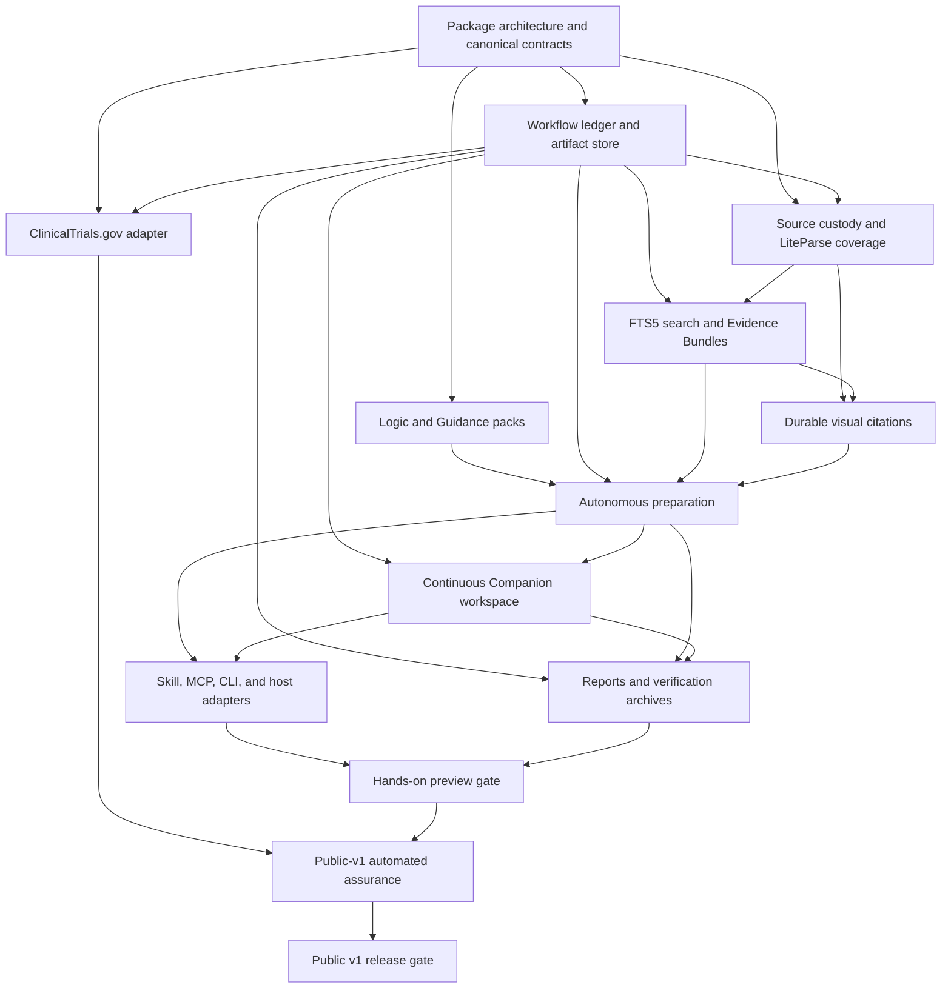

# RoB 2 Kit v1 implementation backlog

**Status:** execution plan  
**Canonical requirements:** [V1-SPEC.md](V1-SPEC.md)  
**Last reconciled:** 2026-07-30

This backlog translates the canonical v1 specification into dependency-ordered,
independently verifiable GitHub issues. It does not replace the specification or
introduce new product decisions.

The sequence is deliberately preview-first. It reaches a safe, end-to-end build
for the owner before spending time on the full public-v1 assurance matrix. A
ticket is complete only when its acceptance criteria pass; being able to
demonstrate a partial happy path is not enough.

## Sequencing rules

- Work only from unblocked issues. GitHub's native **blocked by** relationships
  are authoritative; the table below is a readable projection.
- Keep the Python application and domain layers authoritative. MCP, CLI, GUI,
  skills, and host adapters remain thin interfaces.
- Add the narrowest fixture that proves each behavior while implementing it.
  Do not postpone all testing to the release-gate issues.
- Do not split tickets merely by schema, file, or specification heading.
  Create a follow-up only when work can be independently reviewed and verified.
- Do not broaden v1 to cluster, crossover, adherence-effect, hosted inference,
  dense retrieval, or research-validation work.
- The private `eval/reference/` corpus may inform local testing but must not
  enter distributable fixtures or be treated as a correctness oracle.

## Dependency graph

The ClinicalTrials.gov adapter can be built alongside source ingestion once
the ledger exists. It is required for the public-v1 claim but is not allowed to
delay the first local-PDF preview path.

## Implementation issues

| Order | Issue | Starts after | Independent proof |
| --- | --- | --- | --- |
| 1 | [Establish the Python package architecture and canonical revision contracts](https://github.com/AliSalman-et-al/rob2-kit/issues/14) | Immediately | Schema, hashing, dependency, and boundary property tests |
| 2a | [Implement versioned RoB 2 logic and guidance packs with deterministic evaluation](https://github.com/AliSalman-et-al/rob2-kit/issues/15) | Package contracts | Exhaustive conformance, invalid-state, trace, and mutation tests |
| 2b | [Implement the transactional workflow ledger and content-addressed artifact store](https://github.com/AliSalman-et-al/rob2-kit/issues/16) | Package contracts | Atomicity, lease, replay, corruption, and targeted-invalidation tests |
| 3a | [Implement project initialization, source custody, and LiteParse coverage](https://github.com/AliSalman-et-al/rob2-kit/issues/17) | Package contracts and ledger | Source/parse fixtures with typed coverage and failure isolation |
| 3b | [Implement the current ClinicalTrials.gov adapter and source projection](https://github.com/AliSalman-et-al/rob2-kit/issues/18) | Package contracts and ledger | Recorded HTTP/provenance fixtures and safe degradation |
| 4 | [Implement canonical evidence units, complete FTS5 search, and frozen bundles](https://github.com/AliSalman-et-al/rob2-kit/issues/19) | Ledger and source ingestion | Full pagination, exact-span, coverage, conflict, and bundle tests |
| 5 | [Implement relevance-gated visual inspection and typed transcriptions](https://github.com/AliSalman-et-al/rob2-kit/issues/20) | Source ingestion and evidence | Spatial-parse retention, exact-span highlight, crop/page navigation, disposition, transcription, and ambiguity fixtures |
| 6 | [Implement the autonomous preparation work-item protocol end to end](https://github.com/AliSalman-et-al/rob2-kit/issues/21) | Logic, ledger, evidence, and visuals | End-to-end fixtures for all outcomes, resume, reuse, and batch isolation |
| 7 | [Build the continuous Companion workspace and human sign-off flow](https://github.com/AliSalman-et-al/rob2-kit/issues/22) | Ledger and preparation | Four-stage projection, Guided/Full audit parity, correction/supersession, human-only sign-off, responsive/accessibility, security, stale-action, and idempotency tests |
| 8a | [Expose the canonical skill, MCP and expert CLI through generated Codex and Claude adapters](https://github.com/AliSalman-et-al/rob2-kit/issues/23) | Preparation and review | Cross-interface contracts, idempotent embedded/system-browser handoff, model-free reconnect, and real-adapter equivalence tests |
| 8b | [Implement deterministic reports, exports, and verification archives](https://github.com/AliSalman-et-al/rob2-kit/issues/24) | Ledger, preparation, and review | Detailed signed-Result/project golden outputs, failure retry, and offline complete/reference archive verification |
| Preview gate | [Pass the dual-host owner preview gate on Windows](https://github.com/AliSalman-et-al/rob2-kit/issues/25) | Interfaces/adapters and reports/archives | Real Codex and Claude Code run plus the owner’s unaided critical flow |
| Public hardening | [Automate the public-v1 trust, security, and portability gates](https://github.com/AliSalman-et-al/rob2-kit/issues/26) | Preview and current registry adapter | Three automated critical journeys, representative accessibility/320px checks, cross-platform CI, and a one-to-one release-blocker evidence matrix |
| Release gate | [Complete the public v1 release gate](https://github.com/AliSalman-et-al/rob2-kit/issues/27) | Public hardening | Frozen release manifest, owner smoke checklist, named logic reviews, real-host checks, and verified archive |

## Companion workspace delivery contract

The redesign stays inside the existing sequence. It does not add a parallel
front-end program or split one owner’s work into a large issue hierarchy.
The affected implementation issues MUST use these boundaries:

| Issue | Required delivery | Independent verification |
| --- | --- | --- |
| Visual inspection | Preserve LiteParse page geometry, spatial items, full requested configuration, and base-page PNG references; bind one exact Canonical span to one or more boxes; own overlays, crops, DPI escalation, crop/full-page navigation, storage, and invalidation; keep form rendering off and expose form-dependent coverage limits. | Contract fixtures reconstruct highlights across DPI values and multiple boxes, reject stale bindings, navigate crop to page, preserve base/derived hashes, and never use discovery boxes as quote verification. |
| Autonomous preparation | Project every Trial × Result through Queue, Processing, and Review queue; reveal a final judgment only in Review queue; expose checkpoints and interruption/terminal reasons; keep the whole-batch human-review gate. | Batch fixtures cover mixed terminal outcomes, disconnect/resume, and prove queued/processing cards cannot expose or imply an Assessment decision. |
| Continuous Companion workspace | Add joined read projections and the Clinical canvas Ready/Prepare/Review/Complete shell; Trial × Result source previews; three attention tiers; Result-scoped Guided review; Pinned Evidence Desk Full audit; impact-sidecar corrections; superseding comparison/resume; exact Result sign-off, withdrawal, invalidation, and progressive Complete. Materialize canonical reviewer, disposition, and sign-off revisions before presenting them as authoritative. | Component/projection tests plus the three critical journeys prove complete evidence visibility, Guided/Full state parity, individually opened Domains, no bulk approval/sign-off, durable correction resume, scoped invalidation, correct output status, and rejection of stale/wrong-Result actions. |
| Skill, MCP, CLI, and host adapters | Keep the harness as control plane; `open_review` starts/reconnects idempotently, attempts embedded launch once, always returns a URL, and falls back to the system browser; local updates and waiting consume no repeated inference. | Contract and real-host tests compare ledger consequences, close/reopen the browser and host, exercise both launch surfaces, and recover from browser-launch failure without losing review position. |
| Reports, exports, and archives | Materialize signed-Result HTML/Markdown, canonical JSON, robvis CSV, Project XLSX/status report, Complete and Reference archives, immutable history, and retryable output generation with the detail required by the specification. | Golden fixtures agree on exact Result/revision, judgments, limitations, sign-off and terminal status; output failure preserves sign-off; a complete archive verifies offline and a reference archive carries its limitation. |
| Preview, hardening, and release gates | Use owner-only scripted acceptance. Run the three automated journeys, representative automated accessibility and 320px checks, one owner keyboard/enlarged-display smoke check, embedded/system-browser parity, and both real-host Windows checks. | Zero known dangerous or blocking defects; every blocker maps to passing output or one short checklist entry; fixes rerun their affected scenario. No external participant process or independent-comprehension claim is required. |

## Milestone boundaries

### Hands-on preview

The preview gate is intentionally narrow but real. It requires the complete
local-PDF assessment, Companion workspace journey, evidence review,
correction/resume, human-only sign-off, reporting, and dual-host Windows path.
It does not wait for external usability research, formal accessibility
conformance, validation-study execution, or cosmetic polish.

Issues discovered during owner use are triaged by consequence: critical
blockers and dangerous misunderstandings block the preview gate and require
the affected scenario to be rerun; minor friction with a clear safe path
becomes normal follow-up work.

### Public v1

Public v1 adds the complete current ClinicalTrials.gov claim, cross-platform
package/core CI, adversarial and security coverage, the three automated
critical journeys, representative accessibility/320px checks, all
acceptance-gate evidence, named human review of the Logic/Conformance
transcription, and a frozen cross-host release manifest. Research validation,
external usability testing, and manuscripts remain outside this backlog.

## Changing the plan

The specification remains the authority. If implementation reveals a genuine
unresolved product decision, stop that issue and open a focused decision ticket
before changing behavior. If it only reveals more executable work, add the
smallest implementation issue, give it explicit acceptance criteria, and wire
its native dependencies. Avoid turning this backlog into a detailed project
management system.
